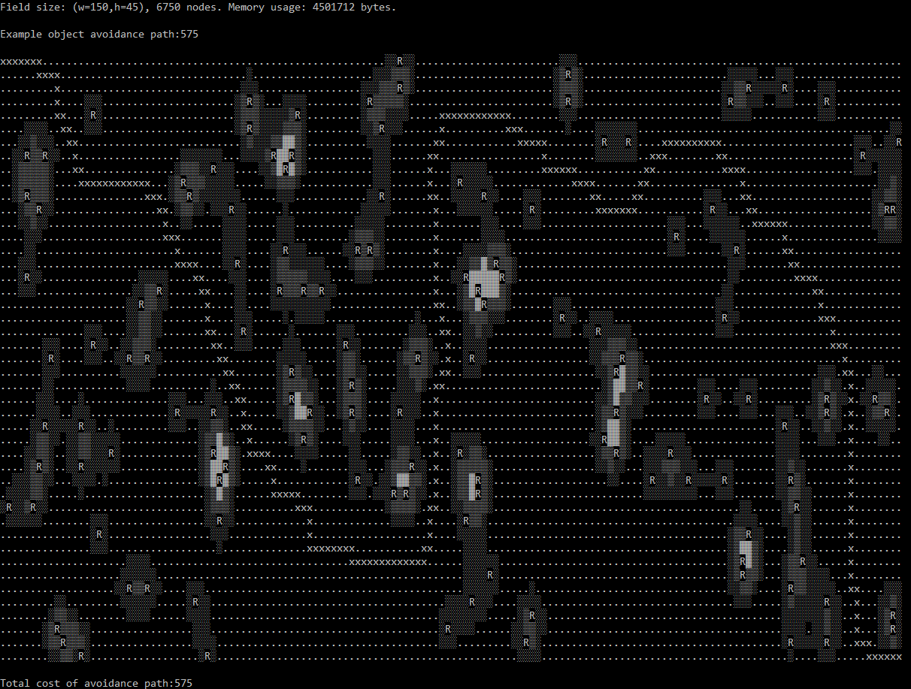

# containers_GraphClassImplementation
Own implementation of Graph data structure, traversal functions and shortest path algo.

Based on "Programming Abstractions in C++" / Eric S. Roberts / Chapter 19.

Main branch:
Tests a graph of airline connections between 10 cities in the US.
* SimpleGraph implementation

Branch DNTGraph:
Uses the graph class to find optimal paths for robot object avoidance using cost landscapes.

